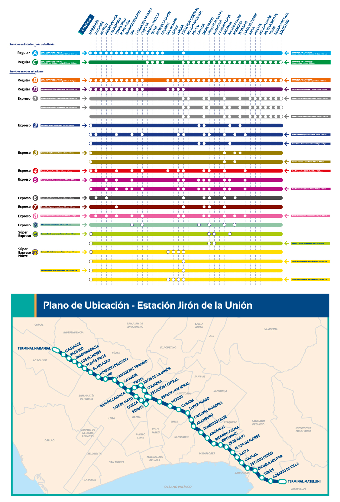
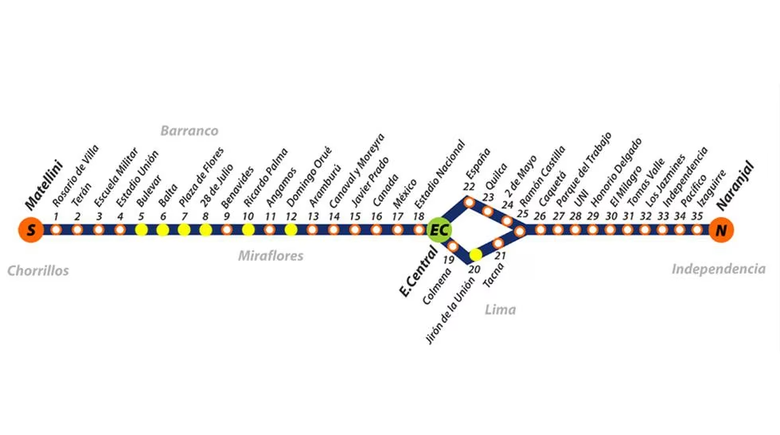

**Universidad Peruana de Ciencias Aplicadas**

**<h1> INFORME DEL TRABAJO FINAL (TF) </h1>**

  * CURSO [COMPLEJIDAD ALGORÍTMICA]

  * Carrera de Ingeniería de Software y Ciencias de la Computación

  * **Sección:** CC51

  -----------------------------------------------------------------------
  **Alumnos: 3**         
  ---------------------- ------------------------------------------------
  
  | **Código** | **Nombres y apellidos** |
  | --- | --- |
  | u202119276 | Anthony Samir Nuñez Martinez |
  | u201911727 | Bárbara Antonella Espinoza Delgado |
  | u20211a118  |Condori Lozano Alessandro Ramiro |
  
  -----------------------------------------------------------------------

<h6>Noviembre - 2023</h6>

Tabla de Contenidos

1\. Descripción del Problema

> 1.1. Descripción de la problemática

2\. Descripción y visualización del conjunto de datos

> 2.1. Descripción de conjunto de datos
>
> 2.2. Visualización del conjunto de datos

3\. Propuesta

4\. Diseño del Aplicativo

> 4.1. Requisitos para el desarrollo de la aplicación
>
> 4.2. Diseño arquitectónico de la aplicación
>
> 4.3. Diseño detallado
>
> 4.4. Implementación y pruebas

> 4.5. Optimización y mejoras

5\. Validación de Resultados y Pruebas

6\. Conclusiones

7\. Referencias Bibliográficas

8\. Anexos

**1. Descripción del Problema**

En este apartado se redactara la descripción y fundamentación del
problema citando fuentes.

> **1.1. Descripción de la problemática**
>
> En 2023 la cantidad de usuarios del metropolitano se ha incrementado significativamente terminada la pandemia, según la Autoridad de Transporte Urbano para Lima y Callao (2023) En la ruta troncal, se realizaron más de 29 millones de ingresos al servicio, esta cifra es igual de grande que la pérdida de tiempo por una falta de optimización de tiempo al no usarlo de manera correcta, según el diario el comercio (2017)  el impacto en los ingresos de los trabajadores es alarmante. En el caso de los hombres, el tiempo de espera dentro de las estaciones del Metropolitano por mes equivale a S/155,04, S/232,8 y S/310,08 (siempre para demoras de entre 20 y 40 minutos). Mientras que para las mujeres, las demoras por la espera del transporte suman S/110,4, S/163,2 y S/220,8 al mes, es decir, sin retrasos podrían ganar entre 8,3%, 12,2% y 16,6% más. La mayoría de usuarios tienen grandes demoras en las filas porque los usuarios saturan las líneas de ruta normal mientras que los expresos tienen una menor cantidad de pasajeros por la falta de conocimientos sobre sus paradas aun si estos pueden llevarlos de manera >más rápida.
>
> **1.1. Objetivo del trabajo**
>
> El objetivo del trabajo es que en caso el pasajero cuente con la tarjeta del metropolitano, muestre la línea que llevará a un pasajero de una estación a otra de manera más rápida y con menos paradas mediante un sistema que mediante el uso de grafos mostrarle que linea debe tomar y un tiempo aproximado de llegada, y en caso el pasajero no cuente con la tarjeta, le muestre el bus que le cobrará menos dinero desde la estación en la que se encuentra hasta la estación de salida.

**2. Descripción y visualización del conjunto de datos**

> **2.1. Descripción de conjunto de datos**
>
> En el presente trabajo se buscará analizar las distintas rutas,
> horarios y paradas de cada servicio del Metropolitano de Lima.
>
> La siguiente imagen representa distintas rutas de cada servicio del
> metropolitano:
>
> 
>
> Metropolitano (s.f) Servicios del metropolitano
>
> También desde la misma fuente se llegó a encontrar datos sobre los
> horarios de partida y llegada de cada bus. Con esta información en
> mente, otorgada por el metropolitano de Lima, se puede realizar la
> siguiente tabla:

| Servicio | Estaciones | Estaciones finales | Horarios(Norte a Sur) | Horarios(Sur a Norte) |
| --- | --- | --- | --- | --- |
| Regular A | Naranjal, Izaguirre, Pacífico, Indenpendencia, Los Jazmines, Tomás Valle, El Milagro, Honorio Delgado, UNI, Parque del Trabajo, Caquetá, Ramón Castilla, Tacna, Jirón de la Unión, Colmena y Estación Central | Naranjal (Norte) y Estación central (Sur) | Lun - Vie (5:00 am a 10:30 pm) Sab (5:00 am a 10:15 pm) Dom - Feriado (5:15 am a 9:55 pm)| Lun - Vie (5:40 am a 11:00 pm) Sab (5:40 am a 10:45 pm) Dom - Feriado (5:55 am a 10:00 pm) |
| Regular B | Naranjal, Izaguirre, Pacífico, Indenpendencia, Los Jazmines, Tomás valle, El milagro, Honorio delgado, UNI, Parque del trabajo, Caquetá, Dos de Mayo, Quilca, España, Estación central, Estado nacional, México, Canadá. Javier prado, Carnaval moreyra, Aramburú, Domingo ouré, Angamos, Ricardo palma, Benavides, 28 de julio, Plaza de flores, Balta, Bulevar, Estadio Unión, Escuela militar, Terán, Rosario de villa y Matellini | Naranjal (Norte) y Matellini (Sur) | Lun - Vie (9:00 am a 11:00 pm) Sab (5:00 am a 11:00 pm) Dom - Feriado (5:00 am a 10:00 pm) |
| Regular C |Ramón Castilla, Tacna, Jirón de la Unión, Colmena, Estación central, Estadio nacional, México, Canadá, Javier Prado, Canaval Moreyna, Aramburú, Domingo Ouré, Angamos, Ricardo Palma, Benavides, 28 de Julio, Plaza de flores, Balta, Bulevar, Estación unión, Escuela militar, Terán, Rosario de Villa y Matellini | Matellini (Norte) y Ramón Castilla (Sur) | Lun - Vie (5:00 am a 10:05 pm) Sab (5:15 am a 10:05 pm) Dom - Feriado (5:25 am a 10:00 pm) | Lun - Vie (5:00 am a 11:00 pm) Sab (5:30 am a 10:55 pm) Dom - Feriado (5:30 am a 9:55 pm) |
| Regular D | Naranjal, Izaguirre, Pacífico, Indenpendencia, Los Jazmines, Tomás valle, El milagro, Honorio delgado, UNI, Parque del trabajo, Caquetá, Dos de Mayo, Quilca, España y Estación central. | Naranjal (Norte) y Estación central (Sur) | Lun - Vie (5:00 am a 9:00 am) | Lun - Vie (5:35 am a 9:30 am) |
| Expreso 1 (Mañana) | Estación central, Estadio nacional, Javier Prado, Carnaval moreyra, Angamos, 28 de Julio, Balta, Bulevar, Estado unión, Escuela militar, Terán, Rosario de Villa y Matellini. | Estación central (Norte) y Matellini (Sur) | Lun - Vie (5:00 am a 9:00 am) | Lun - Vie (5:30 am a 9:30 am) |
| Expreso 1 (Tarde) | Estación central, Estadio nacional, Javier Prado,  Angamos, Ricardo Palma, 28 de Julio, Balta, Bulevar, Estado unión, Escuela militar, Terán, Rosario de Villa y Matellini. | Estación central (Norte) y Matellini (Sur) | Lun - Vie (5:00 pm a 9:00 pm) | Lun - Vie (5:30 pm a 9:30 pm) |
| Expreso 2 (Mañana) | Naranjal, Izaguirre, Tomas Valle, UNI, Caquetá, España, Estación central, Javier prado, Angamos, Benavides y Plaza de flores | Naranjal (Norte) y Plaza de flores (Sur) | Lun - Vie (5:00 am a 9:00 am) | Lun - Vie (5:30 am a 9:30 am) |
| Expreso 2 (Tarde) | Naranjal, Canadá, Javier Prado, Ricardo Palma | Naranjal (Norte) y Ricardo Palma (Sur) | **NO DISPONIBLE** | Lun - Vie (5:00 pm a 9:00 pm) |
| Expreso 3 (Mañana) | Naranjal, Canadá, Javier Prado, Ricardo Palma | Naranjal (Norte) y Ricardo Palma (Sur) | Lun - Vie (5:30 am a 9:00 am) | **NO DISPONIBLE** |
| Expreso 3 (Tarde) | Naranjal, Canadá, Javier Prado, Ricardo Palma | Naranjal (Norte) y Benavides (Sur) | **NO DISPONIBLE** | Lun - Vie (5:00 pm a 9:00 pm) |
| Expreso 4 | Naranjal, Izaguirre, Tomás Valle, UNI, Caquetá, Dos de Mayo, España, Estación central, Javier Prado, Carnaval Moreyra, Angamos y Plaza de Flores. | Naranjal (Norte) y Plaza de Flores (Sur) | Sab (6:00 am a 9:00 pm) | Sab (6:00 am a 9:30 pm)
| Expreso 5 | Naranjal, Indenpendencia, Tomás Valle, UNI, Caquetá, España, Estación central, Canadá, Javier Prado, Carnaval Moreyra, Angamos, Ricardo Palma y Plaza de Flores. | Naranjal (Norte) y Plaza de Flores (Sur) | Lun - Vie (9:00 am a 5:00 pm) |  Lun - Vie (9:00 am a 4:55 pm) |
| Expreso 6 | Izaguirre, Indenpendencia, Estación central, Javier Prado, Carnaval Moreyra, Angamos y Benavides. | Izaguirre (Norte) y Benavides (Sur) | Lun - Vie (5:30 am a 9:00 am) | **NO DISPONIBLE** |
| Expreso 7 | Tomás Valle, Estación Central, Javier Prado, Carnaval Moreyra y Angamos. | Tomás Valle (Norte) y Angamos (Sur) | Lun - Vie (5:30 am a 9:00 am) | **NO DISPONIBLE** |
| Expreso 8 | Izaguirre, Indenpendencia, Tomás Valle, UNI, Caquetá, España, Estación Central, Javier Prado, Carnaval Moreyra, Angamos, Benavides y Plaza de Flores. | Izaguirre (Norte) y Plaza de Flores (Sur) | Lun - Vie (5:00 pm a 8:20 pm) | Lun - Vie (5:00 pm a 9:00 pm) |
| Expreso 9 | UNI, Caqueta, Canada, Carnaval y Moreyra, Angamos y Benavides | Uni y Benavides | Lun - Vie 5:00 pm a 8:20 pm | **NO DISPONIBLE** |
| Expreso SX | Naranjal, Canaval y Moreyra, Aramburu y Ricardo Palma | Naranjal y Ricardo Palma | Lun - Vie (5:45 am - 9:00 am) | **NO DISPONIBLE** |
| Expreso SXN | Naranjal, Canaval y Moreyra y Aramburu | Naranjal y Aramburu | Lun - Vie 5:00 pm a 9:00 pm | **NO DISPONIBLE** |

> **2.2. Visualización del conjunto de datos**
>
> A partir de la base de datos el ejemplo que tomará nuestro grafo será
> el siguiente:
>
> 

**3. Propuesta**
Algoritmo BFS

>El algoritmo elegido para la primera opción del proyecto, la cual es la opcion con tarjeta de tarifa plana será el algoritmo de BFS, el cual calcula las distancias mínimas desde un nodo inicial a todos los demás. Debido a que nuestro proyecto busca estrictamente mostrar el camino con menor cantidad de paradas (nodos) y el tiempo de recorrido y cantidad de personas que entran en el bus se asume que es menor mientras se pase por menos paradas, no optamos ni por el algoritmo de Dijkstra ni el de Bellman-Ford, ya que ambos necesitan aristas con peso y estos, en ocasiones, pueden hacer un recorrido con una mayor cantidad de nodos.

>Para esta parte del proyecto los aspectos más importantes a tener en cuenta son: los nodos y las conexiones. Los nodos tendrán un identificador y representan las estaciones; y las conecciones o aristas carecerán de pesos y cada nodo puede contar una gran cantidad de aristas saliendo de ellos.

Algoritmo Prim

>Para la segunda opción del proyecto, la cual es la opción sin tarjeta, se usará el algoritmo de Prim, ya que al no tener tarjeta, se le cobrará al pasajero por parada que haga el bus y este algoritmo voraz muestra el camino más barato sin importar si es el más largo tomando en cuenta que el pasajero no tiene apuros pero si busca economizar lo más posible su viaje. 

>Para esta parte del proyecto los aspectos más importantes a tener en cuenta son: los nodos, los pesos y las conexiones. Los nodos tendrán un identificador y representan las estaciones; y las conecciones o aristas tendrán pesos que representan el costo de ir de una estación a otra.

**4. Diseño del Aplicativo**

> **4.1. Requisitos para el desarrollo de la aplicación**
>
> La estructura de la aplicación consisteEl proyecto se realizará con el lenguaje de programación Python en visual studio code. Además de conocimientos aprendidos en clase y autónomamente sobre la teoría de grafos, del algoritmo BFS para hallar el camino con menor cantidad de nodos, y del algoritmo Prim para hallar el camino más barato. Será necesario también los datos de las estaciones del metropolitano y las paradas que realiza cada línea.	

>Como requisitos principales de la aplicación tenemos: Identificar las estaciones habilitadas del metropolitano, debido a que el proyecto requiere de mínimo 1500 nodos, supondremos esta cantidad de estaciones; y realizar las conexiones simulando los recorridos de las líneas. Con el uso de la opción elegida, se obtendrá el recorrido que contenga menor cantidad de nodos entre un nodo de partida y un nodo de llegada, o se obtendrá el camino más barato desde una estación a otra.

>
> **4.2. Diseño arquitectónico de la aplicación**
>
> La estructura de la aplicación consiste en que, en la pantalla de inicio se le muestre al usuario las opciones con tarjeta y sin tarjeta, mediante un grafo con aristas sin peso para la primera opción, se haga la representación de las estaciones del metropolitano y el recorrido de cada línea y haciendo uso del algoritmo BFS se encuentre la línea que realice una menor cantidad de paradas entre la estación de partida y la estación de llegada. Mientras que para la segunda opción se represente el recorrido a hacer, el costo por parada y el costo total del viaje. La representación será gráfica, se almacenarán los nombres de las estaciones y los datos de las líneas en una lista o matriz, y debido a que el lenguaje de programación que se usará será Python, usaremos la librería Graphviz.
>
> **4.3. Diseño detallado**
>
> Para comenzar, se creará una lista en donde se almacenarán los nombres de las estaciones que representan los nodos del grafo. Para la opción con tarjeta se definirán las líneas del metropolitano mediante las conexiones sin peso de los nodos, representando la estación de partida, las estaciones donde realiza paradas y la estación final para cada línea. Además se implementa una función que contenga al algoritmo de BFS y muestre la línea que el usuario debe abordar para llegar a la estación de destino con la menor cantidad de paradas posibles. Para la opción sin tarjeta definirán las líneas del metropolitano mediante las conexiones con peso de los nodos, representando la estación de partida, las estaciones donde realiza paradas y la estación final para cada línea. Además se implementa una función que contenga al algoritmo de Prim y muestre la línea que el usuario debe abordar para llegar a la estación de destino con el menor costo posible
>
> **4.4. Implementación y pruebas**
>
> El código de la aplicación se desarrolló siguiendo los requisitos
> mencionados anteriormente y con un diseño de interfaz agradable y
> comprensible al usuario. A continuación, mostraremos mediante capturas
> de pantalla la interfaz avanzada del proyecto.
>

>

>

>

>

>

>
> **4.5. Optimización y mejoras**
>Acorde a los resultados obtenidos luego de la implementación de los algoritmos en la propuesta, creemos que se podría optimizar funciones con el uso de otras librerías aún no estudiadas, además se podría mejorar el orden y comprensión del código, ya que debido a la combinación del uso de diccionarios y datos aleatorios el código puede resultar poco flexible o difícil de modificar sin afectar su funcionalidad en caso se desee hacer nuevas implementaciones. También se podrían implementar mayores especificaciones y variaciones como diferente ruta de ida y vuelta por expreso o disponibilidad de estos según el día y la hora.

**5. Validación de Resultados y Pruebas**
Grafo generado a partir de la estación Naranjal con los expresos que tienen a la estación como parada y las demás estaciones por las que pasa el expreso.

Ruta más corta entre una estación A a una estación F

Ruta más barata desde la estación 3 a la estación 5 y el precio a pagar

**6. Conclusiones**
>Acorde a los resultados obtenidos luego de la implementación de los algoritmos en la propuesta, creemos que se podría optimizar funciones con el uso de otras librerías aún no estudiadas, además se podría mejorar el orden y comprensión del código, ya que debido a la combinación del uso de diccionarios y datos aleatorios el código puede resultar poco flexible o difícil de modificar sin afectar su funcionalidad en caso se desee hacer nuevas implementaciones. También se podrían implementar mayores especificaciones y variaciones como diferente ruta de ida y vuelta por expreso o disponibilidad de estos según el día y la hora.

**7. Referencias Bibliográficas**

El Comercio (2017) Demoras en Metropolitano te quitan hasta el 17% de tu
sueldo. Recuperado de:
[[https://elcomercio.pe/economia/personal/metropolitano-cuestan-demoras-427454-noticia/]{.underline}](https://elcomercio.pe/economia/personal/metropolitano-cuestan-demoras-427454-noticia/)

ATU (2023). ATU: más de 45 millones de viajes se realizaron de mayo a
julio en el Metropolitano y los corredores complementarios. Recuperado
de:
[[https://www.gob.pe/institucion/atu/noticias/819820-atu-mas-de-45-millones-de-viajes-se-realizaron-de-mayo-a-julio-en-el-metropolitano-y-los-corredores-complementarios]{.underline}](https://www.gob.pe/institucion/atu/noticias/819820-atu-mas-de-45-millones-de-viajes-se-realizaron-de-mayo-a-julio-en-el-metropolitano-y-los-corredores-complementarios)

Autoridad de Transporte Urbano para Lima y Callo (ATU).(s. f.).
*Metropolitano*. Recuperado
de:[[http://www.metropolitano.gob.pe/]{.underline}](http://www.metropolitano.gob.pe/)
\[Consulta: 11 de Septiembre del 2023\].

**8. Anexos**
